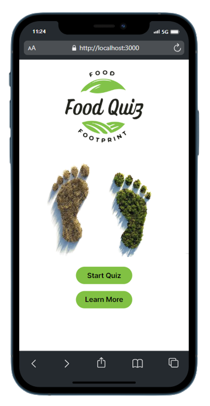
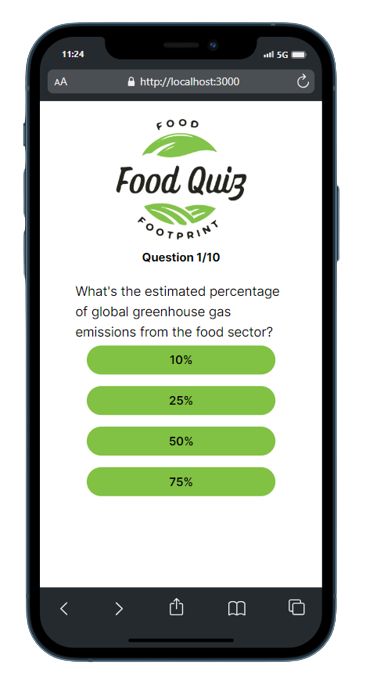
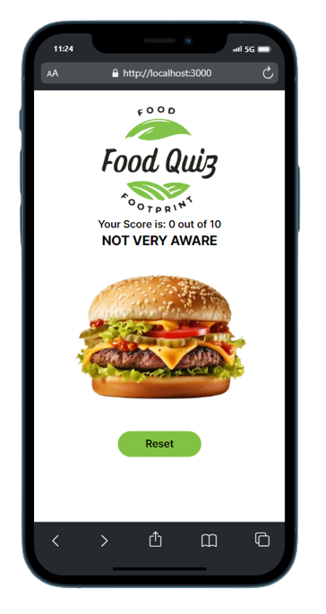

#Quiz Food Footprint

This app is designed to raise awareness about the environmental and social impact of food choices. The main page features an engaging quiz accessible through a "Start Quiz" button. The quiz aims to empower users with knowledge about the consequences of their food choices, fostering a deeper understanding of sustainability. Upon completion, users receive a score indicating their level of awareness regarding food-related issues, encouraging a more informed approach to making sustainable and socially responsible food choices.

## Technologies Used

- 
- 
- 
- 
- 

## Live Demo

Check out the live demo of Mindful at: [Quiz Food Footprint](https://quiz-food-footprint-fzp1tdguh-partimeproject1-gmailcom.vercel.app/)

## Installation

To run Mindful on your local machine, follow these steps:

1. Clone the repository using:
   ```bash
   git clone https://github.com/TonyLig/Quiz-Food-Footprint.git
   ```
2. Install the required dependencies with:

   ```bash
   npm install
   ```

3. Start the application with:

   ```bash
   npm start
   ```

## Screenshots

Here are some screenshots of the Mindful app:






